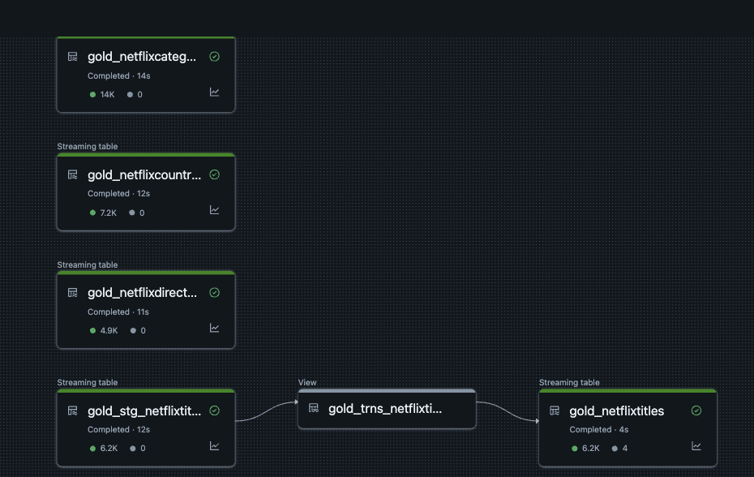

# Azure Data Factory and Databricks Pipeline Project

## Project Overview
This project outlines a data pipeline using Azure Data Factory (ADF) and Databricks for data ingestion, transformation, and processing across different storage layers: Raw, Bronze, Silver, and Gold.

## Steps to Implement

### Azure Data Factory (ADF) Setup
1. **Create a Resource Group**:
   - Navigate to Azure Portal
   - Create a new resource group for organizing resources.

2. **Create a Storage Account**:
   - Under the resource group, create an Azure Data Lake Storage (ADLS) account.
   - Enable the Hierarchical Namespace to support directories.

3. **Create Storage Containers**:
   - Create the following containers: `raw`, `bronze`, `silver`, `gold`.

4. **Create an Azure Data Factory Resource**:
   - Set up an ADF instance within the resource group.

5. **Set Up Linked Services**:
   - **HTTP Linked Service**:
     - Configure it to extract raw data from an external source.
   - **Data Lake Linked Service**:
     - Configure it to store the extracted raw data.

6. **Create an ADF Pipeline**:
   - **Copy Activity**:
     - Define source and sink connections.
     - Use the HTTP linked service for data extraction.
     - Use the Data Lake linked service to store the data in the Bronze layer.
     - Configure dynamic parameters for file names in the `relative URL`.
     - Configure dynamic parameters (`folder_name` and `file_name`) for Data Lake storage.
   
7. **Implement Iteration and Validation**:
   - **ForEach Activity**:
     - Create an array of folder and file names as pipeline parameters.
     - Move the `Copy Activity` inside the `ForEach` loop.
     - Retrieve folder and file names dynamically from the loop.
   - **Validation and Metadata Extraction**:
     - Add `Validation Activity`, `Web Activity` to fetch metadata, and `Set Variable Activity` to store the metadata.

### Databricks Setup
1. **Create a Databricks Account**:
   - Use a trial premium account for setup.

2. **Connect to Admin Console**:
   - Provide the Microsoft Extra ID for authentication.

3. **Create a Metastore**:
   - Only one Metastore per region is allowed.

4. **Set Up Access Connector**:
   - Connect Databricks with Data Lake storage.
   - Assign IAM roles in the Storage Account.
   - Attach the access connector as a member.

5. **Connect to Azure Databricks Workspace**.

6. **Create a Catalog and schema and External Storage for all the layers**:
   - Attach credentials using the Access Connector Resource ID.

### Implementing Workflows in AzureDatabricks
1. **Create an Autoloader Notebook**:
   - Configure it to automatically read the raw layer title cloud data streams and write to the Bronze layer.

2. **Implement Silver Layer Transformation**:
   - Create a Silver notebook to move other data which is saved in bronze layer using ADF for each activity pipeline to Silver.
   - Create a Lookup Array Notebook to dynamically fetch source and target folder names using `dbutils.widgets` and `taskValues`.

3. **Set Up Workflows in Databricks**:
   - Create an **Iterative Task** for the Silver Notebook.
   - Use `taskValues` for iteration and parameter passing.
   - Implement a **Lookup Task** to pass folder names to `silver_dim` notebooks.
   - Define a workflow to move `netflix_titles` in bronze layer to silver layer with a condition that executes only if `workDay == 7`.

4. **Create Delta Live Tables (DLT) Pipeline**:
   - Use **Job Clusters** instead of All-Purpose Clusters.
   - Define conditions and rules for Gold Layer processing using Delta Live Tables features.

## Additional Notes
- **Study Autoloader Schema Evolution** to handle schema changes dynamically.
- Ensure access permissions are correctly assigned in IAM for Data Lake Storage.
- Optimize workflows to handle large-scale data efficiently.

## Conclusion
This project establishes an end-to-end pipeline for data ingestion, processing, and transformation using Azure Data Factory and Databricks. By leveraging dynamic parameterization, automated workflows, and Delta Live Tables, it ensures efficient data processing across different storage layers.

